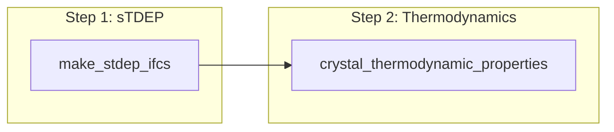

# [Example](@id Example)

This page walks through the full CrystalCumulants.jl workflow on solid neon: obtaining temperature-dependent force constants with sTDEP, then computing quantum-anharmonic thermodynamic properties with the free energy cumulant expansion.

## Workflow overview

The package has two entry points:

1. **`make_stdep_ifcs`** — compute self-consistent TDEP force constants (2nd through 4th order) at a given temperature
2. **`crystal_thermodynamic_properties`** — use those IFCs to compute free energy, internal energy, entropy, and heat capacity



Clone the repository for bundled input files:

```
git clone --depth 1 --branch v0.1.1 https://github.com/ejmeitz/CrystalCumulants.jl.git
```

Run the examples below from the repository root and update `repo_root` and `outpath` as needed.

### Step 1: sTDEP force constants

The first step is to obtain 2nd-, 3rd-, and 4th-order interatomic force constants (IFCs) with stochastic TDEP (sTDEP). Skip to [Step 2](#Step-2:-Thermodynamic-properties) if you already have IFCs in TDEP format.

CrystalCumulants.jl expects **self-consistent phonons** (sTDEP or SSCHA). MD-TDEP or finite-difference IFCs are far less accurate. An in-depth sTDEP tutorial is [here](https://github.com/tdep-developers/tdep-tutorials/tree/main/02_sampling).

`make_stdep_ifcs` runs the sTDEP self-consistency loop and fits 3rd- and 4th-order IFCs from the final set of configurations. Second-order IFCs are iterated to convergence; the harmonic free energy at each iteration is written to `harmonic_free_energy.txt` so you can assess convergence with respect to `n_iter`.

Precomputed IFCs are in [`data/stdep_results`](https://github.com/ejmeitz/CrystalCumulants.jl/tree/main/data/stdep_results) (`iter009` folder; ~2 minutes to reproduce on a typical workstation). Results are stochastic, but should converge to roughly the same values.

Additional sTDEP keyword arguments (forwarded via `kwargs` in Julia or `**kwargs` in Python):

- `mix` — mix configurations from the prior iteration with the current step
- `nconf_init` — number of configurations for iteration 0 (default 8)
- `max_configs` — maximum configurations per iteration (doubles each iter; default 512)

### Step 2: Thermodynamic properties

The second step evaluates vibrational thermodynamic properties using the cumulant expansion. Provide POSCAR files and TDEP-format IFCs (`infile.forceconstant`, `infile.forceconstant_thirdorder`, `infile.forceconstant_fourthorder`) along with LAMMPS potential commands for the true potential energy.

For the bundled neon inputs at 24 K, the free energy should be roughly **−0.0179270 eV/atom** (stochastic; the first few decimals should match). On a 40-core machine this takes ~3 minutes. Reference results: [`data/thermo_results`](https://github.com/ejmeitz/CrystalCumulants.jl/tree/main/data/thermo_results) (25×25×25 free-energy mesh).

You can use IFCs from Step 1 or the precomputed set in [`data/thermo_inputs`](https://github.com/ejmeitz/CrystalCumulants.jl/tree/main/data/thermo_inputs).

!!! tip
    1. Set `JULIA_NUM_THREADS` or `PYTHON_JULIACALL_THREADS` for parallel execution.
    2. Always use the **primitive cell**; cost and memory scale with the number of atoms in the primitive cell.
    3. Run convergence studies on `nconf` and `free_energy_q_mesh` before production runs.

### Output files

For each property, the code writes `F_mean.txt`, `U_mean.txt`, `S_mean.txt`, and `Cv_mean.txt` with rows broken down into harmonic (`F0`, etc.), 0th-order offset, 1st-order, 2nd-order, and total. Only the 0th-order correction has an associated bootstrap standard error. HDF5 versions (`.h5`) are also written.

If `size_study` is enabled, an additional file reports the 0th-order correction as a function of sample count (useful for convergence checks). In Python, results are written to disk and are not returned to the caller.

### Related workflows

| Script | Description |
|--------|-------------|
| [`workflows/neon.jl`](https://github.com/ejmeitz/CrystalCumulants.jl/blob/main/workflows/neon.jl) | Multi-temperature Neon (Julia) |
| [`workflows/neon.py`](https://github.com/ejmeitz/CrystalCumulants.jl/blob/main/workflows/neon.py) | Multi-temperature Neon (Python) |
| [`workflows/neon_lattice_params_stdep.jl`](https://github.com/ejmeitz/CrystalCumulants.jl/blob/main/workflows/neon_lattice_params_stdep.jl) | Volume/temperature sTDEP loop (paper workflow) |
| [`workflows/neon_benchmark.py`](https://github.com/ejmeitz/CrystalCumulants.jl/blob/main/workflows/neon_benchmark.py) | Benchmark / seed study |
| [`workflows/kmesh_studies.jl`](https://github.com/ejmeitz/CrystalCumulants.jl/blob/main/workflows/kmesh_studies.jl) | q-mesh convergence studies |

See the [Theory](@ref Theory) page for background.

## Installation

### Julia

CrystalCumulants.jl depends on [LatticeDynamicsToolkit.jl](https://github.com/ejmeitz/LatticeDynamicsToolkit.jl) (unregistered; Linux required, macOS may work, Windows not supported). LAMMPS is installed automatically; a GPU may trigger a CUDA LAMMPS build that is not used at runtime.

Requirements: Julia 1.10+, Linux. Set `JULIA_NUM_THREADS` before launching Julia.

```julia
using Pkg
Pkg.add(; url = "https://github.com/ejmeitz/LatticeDynamicsToolkit.jl.git", rev = "v0.1.2")
Pkg.add(; url = "https://github.com/ejmeitz/CrystalCumulants.jl.git", rev = "v0.1.1")
```

### Python

The [Python wrapper](https://github.com/ejmeitz/CrystalCumulants.jl/tree/main/python) uses [juliacall](https://juliapy.github.io/PythonCall.jl/stable/juliacall/) to manage Julia dependencies automatically. First use may take a few minutes while LAMMPS and CrystalCumulants.jl are installed.

Requirements: Python 3.10+, Linux (macOS may work; Windows not supported).

!!! warning
    1. Set `PYTHON_JULIACALL_HANDLE_SIGNALS=yes`, or Python cannot pass threads through to Julia. Ctrl-C may not stop the process.
    2. Set `PYTHON_JULIACALL_THREADS=<n-threads>` to control Julia thread count (default 1). You may also need `JULIA_NUM_THREADS`.

```bash
pip install -e ./python
```

```python
from cumulant_analysis import make_stdep_ifcs, crystal_thermodynamic_properties
```

## API reference

### `make_stdep_ifcs`

**Julia**

```julia
make_stdep_ifcs(
    ucposcar_path,
    ssposcar_path,
    outdir,
    pot_cmds,
    n_iter,
    r_cut,
    T,
    maximum_frequency,
    quantum,
    rc3,
    rc4;
    kwargs...
)
```

**Python**

```python
make_stdep_ifcs(
    ucposcar_path,
    ssposcar_path,
    outdir,
    pot_cmds,
    n_iter,
    r_cut,
    T,
    maximum_frequency,
    quantum,
    rc3,
    rc4,
    **kwargs,
)
```

| Argument | Description |
|----------|-------------|
| `ucposcar_path` | Unit-cell POSCAR (TDEP format) |
| `ssposcar_path` | Supercell POSCAR (TDEP format) |
| `outdir` | Output directory for sTDEP results |
| `pot_cmds` | LAMMPS potential commands |
| `n_iter` | Number of self-consistent sTDEP iterations |
| `r_cut` | Pair potential cutoff for 2nd-order IFCs |
| `T` | Temperature (K) |
| `maximum_frequency` | Maximum frequency for the initial IFC guess |
| `quantum` | Sample quantum (`true`/`True`) or classical (`false`/`False`) configurations |
| `rc3` | Cutoff radius for 3rd-order IFC fitting |
| `rc4` | Cutoff radius for 4th-order IFC fitting |
| `kwargs` / `**kwargs` | Additional arguments forwarded to sTDEP (e.g. `mix`, `nconf_init`, `max_configs`) |

### `crystal_thermodynamic_properties`

**Julia**

```julia
crystal_thermodynamic_properties(
    temperatures,
    outpath,
    ucposcar_path,
    ssposcar_path,
    ifc2_path,
    ifc3_path,
    ifc4_path,
    pot_cmds;
    quantum = false,
    nconf = 100_000,
    nboot = 2500,
    size_study = false,
    harmonic_q_mesh = [30, 30, 30],
    free_energy_q_mesh = [25, 25, 25],
    n_threads = Threads.nthreads(),
)
```

Path-like parameters may be a `String` or `(T) -> path`:

```julia
ucposcar_path = (T) -> joinpath("/data", "T$(Int(T))", "infile.ucposcar")
```

**Python**

```python
crystal_thermodynamic_properties(
    temperatures,
    outpath,
    ucposcar_path,
    ssposcar_path,
    ifc2_path,
    ifc3_path,
    ifc4_path,
    pot_cmds,
    *,
    quantum=False,
    nconf=100_000,
    nboot=2500,
    size_study=False,
    harmonic_q_mesh=(30, 30, 30),
    free_energy_q_mesh=(25, 25, 25),
    n_threads=None,
)
```

Path-like parameters may be a `str` or `T -> path` callable:

```python
ucposcar_path = lambda T: f"/data/T{int(T)}/infile.ucposcar"
```

| Keyword | Default | Description |
|---------|---------|-------------|
| `quantum` | `false` / `False` | Quantum or classical statistics |
| `nconf` | `100_000` | Configurations for the 0th-order correction |
| `nboot` | `2500` | Bootstrap samples for 0th-order standard error |
| `size_study` | `false` / `False` | Write 0th-order correction vs. sample count |
| `harmonic_q_mesh` | `[30, 30, 30]` / `(30, 30, 30)` | q-mesh for harmonic contribution |
| `free_energy_q_mesh` | `[25, 25, 25]` / `(25, 25, 25)` | q-mesh for cumulant corrections |
| `n_threads` | all Julia threads / `None` | Parallel thread count |

## Julia example

### sTDEP IFCs

```julia
using CrystalCumulants

repo_root = "<path-to-repo-root>"  # UPDATE
outpath = "<whatever-directory-you-want>"  # UPDATE

T = 24  # Kelvin

r_cut = 6.955
rc3 = r_cut  # cutoff for third-order IFCs
rc4 = 4.0   # cutoff for fourth-order IFCs
pot_cmds = [
    "pair_style lj/cut $(r_cut)",
    "pair_coeff * * 0.0032135 2.782",
    "pair_modify shift yes",
]

n_iter = 10
maximum_frequency = 2.5
quantum = true

basepath = joinpath(repo_root, "data", "stdep_inputs")
ssposcar_path = joinpath(basepath, "infile.ssposcar")
ucposcar_path = joinpath(basepath, "infile.ucposcar")

make_stdep_ifcs(
    ucposcar_path,
    ssposcar_path,
    outpath,
    pot_cmds,
    n_iter,
    r_cut,
    T,
    maximum_frequency,
    quantum,
    rc3,
    rc4,
)
```

### Thermodynamic properties

```julia
using CrystalCumulants

repo_root = "<path-to-repo-root>"  # UPDATE
outpath = "<whatever-directory-you-want>"  # UPDATE
basepath = joinpath(repo_root, "data", "thermo_inputs")

T = 24  # Kelvin

r_cut = 6.955
pot_cmds = [
    "pair_style lj/cut $(r_cut)",
    "pair_coeff * * 0.0032135 2.782",
    "pair_modify shift yes",
]

nconf = 100_000
nboot = 5000
size_study = true
harmonic_q_mesh = [30, 30, 30]
free_energy_q_mesh = [15, 15, 15]  # ~15×15×15 is often sufficient

ssposcar_path = joinpath(basepath, "infile.ssposcar")
ucposcar_path = joinpath(basepath, "infile.ucposcar")

ifc2_path = joinpath(basepath, "infile.forceconstant")
ifc3_path = joinpath(basepath, "infile.forceconstant_thirdorder")
ifc4_path = joinpath(basepath, "infile.forceconstant_fourthorder")

crystal_thermodynamic_properties(
    [T],
    outpath,
    ucposcar_path,
    ssposcar_path,
    ifc2_path,
    ifc3_path,
    ifc4_path,
    pot_cmds;
    quantum = true,
    nconf = nconf,
    nboot = nboot,
    size_study = size_study,
    harmonic_q_mesh = harmonic_q_mesh,
    free_energy_q_mesh = free_energy_q_mesh,
)
```

## Python example

### sTDEP IFCs

```python
from os.path import join

from cumulant_analysis import make_stdep_ifcs

repo_root = "<path-to-repo-root>"  # UPDATE
outpath = "<whatever-directory-you-want>"  # UPDATE

T = 24.0  # Kelvin

r_cut = 6.955
rc3 = r_cut  # cutoff for third-order IFCs
rc4 = 4.0   # cutoff for fourth-order IFCs
pot_cmds = [
    f"pair_style lj/cut {r_cut}",
    "pair_coeff * * 0.0032135 2.782",
    "pair_modify shift yes",
]

n_iter = 10
maximum_frequency = 2.5
quantum = True

basepath = join(repo_root, "data", "stdep_inputs")
ssposcar_path = join(basepath, "infile.ssposcar")
ucposcar_path = join(basepath, "infile.ucposcar")

make_stdep_ifcs(
    ucposcar_path,
    ssposcar_path,
    outpath,
    pot_cmds,
    n_iter,
    r_cut,
    T,
    maximum_frequency,
    quantum,
    rc3,
    rc4,
)
```

### Thermodynamic properties

```python
from os.path import join

from cumulant_analysis import crystal_thermodynamic_properties

repo_root = "<path-to-repo-root>"  # UPDATE
outpath = "<whatever-directory-you-want>"  # UPDATE
basepath = join(repo_root, "data", "thermo_inputs")

T = 24.0  # Kelvin

r_cut = 6.955
pot_cmds = [
    f"pair_style lj/cut {r_cut}",
    "pair_coeff * * 0.0032135 2.782",
    "pair_modify shift yes",
]

nconf = 100_000
nboot = 5000
size_study = True
harmonic_q_mesh = (30, 30, 30)
free_energy_q_mesh = (15, 15, 15)  # ~15×15×15 is often sufficient

ssposcar_path = join(basepath, "infile.ssposcar")
ucposcar_path = join(basepath, "infile.ucposcar")

ifc2_path = join(basepath, "infile.forceconstant")
ifc3_path = join(basepath, "infile.forceconstant_thirdorder")
ifc4_path = join(basepath, "infile.forceconstant_fourthorder")

crystal_thermodynamic_properties(
    [T],
    outpath,
    ucposcar_path,
    ssposcar_path,
    ifc2_path,
    ifc3_path,
    ifc4_path,
    pot_cmds,
    quantum=True,
    nconf=nconf,
    nboot=nboot,
    size_study=size_study,
    harmonic_q_mesh=harmonic_q_mesh,
    free_energy_q_mesh=free_energy_q_mesh,
)
```

### Temperature-dependent paths

```python
from os.path import join

base = "/data/stdep/RESULTS"

crystal_thermodynamic_properties(
    [100.0, 200.0, 300.0],
    lambda T: f"/out/T{int(T)}",
    lambda T: join(base, f"T{int(T)}_0", "infile.ucposcar"),
    lambda T: join(base, f"T{int(T)}_0", "infile.ssposcar"),
    lambda T: join(base, f"T{int(T)}_0", "infile.forceconstant"),
    lambda T: join(base, f"T{int(T)}_0", "infile.forceconstant_thirdorder"),
    lambda T: join(base, f"T{int(T)}_0", "infile.forceconstant_fourthorder"),
    pot_cmds,
)
```
