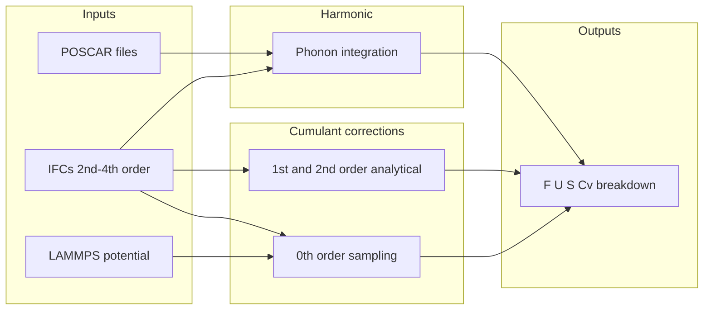

# Theory

@id Theory

## Overview

CumulantAnalysis.jl implements the free energy cumulant expansion for crystals, yielding quantum-anharmonic thermodynamic properties (free energy, internal energy, entropy, and heat capacity) from temperature-dependent interatomic force constants (IFCs).

<!-- TODO: Add paper title, authors, and citation block from manuscript -->

## Effective Hamiltonian

The total potential energy of a configuration is decomposed into a harmonic part and anharmonic corrections derived from IFCs. In the implementation, energies are split as:

\[
V = V_0 + V_2 + V_3 + V_4
\]

where:

- ``V`` is the true potential energy evaluated with LAMMPS
- ``V_2``, ``V_3``, ``V_4`` are second-, third-, and fourth-order Taylor expansions from the IFCs
- ``V_0 = V - V_2 - V_3 - V_4`` is the residual (0th-order cumulant variable)

<!-- TODO: Paste Eq. for Taylor expansion / effective Hamiltonian from manuscript -->

## Harmonic baseline

Before cumulant corrections, the code integrates over the Brillouin zone to obtain harmonic thermodynamic properties ``F_0``, ``S_0``, ``U_0``, and ``C_{v,0}``. The `harmonic_q_mesh` keyword controls the q-mesh used for this integration. Results can be computed in the quantum or classical limit (`quantum` keyword).

<!-- TODO: Paste equations for harmonic free energy, entropy, internal energy, and heat capacity from manuscript -->

<!-- TODO: Paste equations for quantum vs classical phonon occupation from manuscript -->

## Cumulant expansion

Thermodynamic properties are written as a harmonic baseline plus cumulant corrections through second order:

| Order | Method in code | Description |
|-------|----------------|-------------|
| 0th | Stochastic sampling + bootstrap | Estimated from configurations; standard error via `nboot` bootstraps |
| 1st | Analytical (`free_energy_corrections`) | From 3rd-order IFCs |
| 2nd | Analytical (`free_energy_corrections`) | From 3rd- and 4th-order IFCs |

The 0th-order correction uses the random variable ``X = V - V_2 - V_3 - V_4`` and estimates ``\langle X \rangle`` and its temperature derivatives via sample statistics. Only the 0th-order term carries a bootstrap standard error in the output files.

<!-- TODO: Paste equations for κ₀, κ₁, κ₂ from manuscript -->

<!-- TODO: Paste equations relating cumulants to F, S, U, Cᵥ corrections from manuscript -->

## Computational workflow

Typical workflow:

1. **sTDEP** — obtain self-consistent 2nd-order IFCs with `make_stdep_ifcs` (expects methods like sTDEP or SSCHA; MD-TDEP or finite-difference IFCs are less accurate).
2. **Higher-order IFCs** — extract 3rd- and 4th-order IFCs with TDEP or LatticeDynamicsToolkit.jl.
3. **Thermodynamic properties** — run `crystal_thermodynamic_properties` to produce harmonic and cumulant-corrected ``F``, ``U``, ``S``, and ``C_v``.

## Limitations

- **Polar interactions** are not included. Polar terms in `infile.forceconstant` are ignored even if present.
- **Self-consistent phonons** are expected for accurate IFCs; non-self-consistent methods reduce accuracy.
- **Primitive cell** should be used; cost scales with the number of atoms in the primitive cell.

## Further reading

See the [Julia](@ref Julia) page for a worked example and the [Home](index.md) page for practical tips on convergence (`nconf`, `free_energy_q_mesh`, `size_study`).
